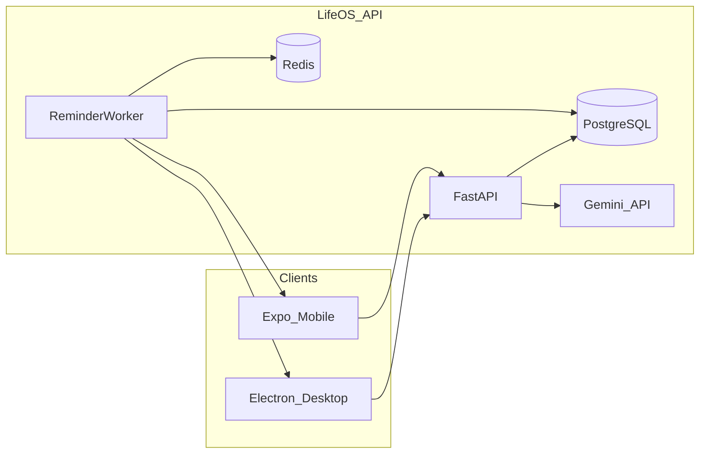

# LifeOS LifeManager Plan

## Product north star

A calm, cute AI companion that turns overwhelm into a clear calendar of tasks and events. Users chat with the AI to create/update items; the app runs in the background and nudges them when something is due, forgotten, or unfinished. No feature bloat — chat, calendar, tasks, reminders, settings.

## Chosen tech stack

| Layer | Choice | Why |
|-------|--------|-----|
| Backend (`LifeOS`) | **FastAPI** + PostgreSQL + Redis | Async-friendly for Gemini streaming; light APIs; easy background workers for reminders |
| Mobile (`LifeOS_Mobile`) | **React Native + Expo** (Expo Router) | Strong push notifications; fast iteration |
| Desktop (`LifeOS_Desktop`) | **Electron + React + Vite** | Reliable Windows tray + OS notifications + always-on background |
| Shared logic | Small shared package (TypeScript types + API client) later; start duplicated if faster | Keep early velocity, extract when screens stabilize |
| AI | **Google Gemini** | Chat → structured task/event extraction |
| Auth | Email/password + JWT (refresh tokens) | Simple MVP; OAuth can come later |
| Billing | Stripe for hosted AI credits; Settings toggle for **BYOK** (user Gemini key stored encrypted) | Paid API vs own-key |

**Not choosing Django** — admin/ORM are nice, but FastAPI fits streaming chat, lightweight mobile APIs, and reminder workers better for this product.

## Architecture (high level)

**Core flows**

1. User chats → FastAPI streams Gemini → model returns structured JSON (create/update/complete task or event) → saved to DB → calendar/task UI updates.
2. Reminder worker scans due/overdue items → push to Expo / Electron notification → optional follow-up if still incomplete.
3. Settings: `Use LifeOS AI` (metered) **or** `Use my Gemini key` (BYOK, encrypted at rest).

## UI / UX principles (non-negotiable)

- Soft, cute, airy — pastel palette, rounded shapes, friendly empty states; one calm companion placeholder until the real character lands.
- **Few screens only:** Home (today + chat), Calendar, Tasks, Settings.
- Chat is the primary create path; manual forms are minimal (title, time, mark done).
- No dashboards, analytics walls, social, or “productivity suites.”
- Same visual language on mobile and desktop (shared design tokens).

## Repo layout

- `LifeOS` — FastAPI backend, DB models, Gemini service, billing, workers; root `plan.md` (this file)
- `LifeOS_Mobile` — Expo app
- `LifeOS_Desktop` — Electron app (tray + notifications)

## Data model (MVP)

- **User** — email, password hash, AI mode (`hosted` | `byok`), encrypted API key, credit balance
- **Task** — title, notes, due_at, status (`open` | `done`), remind_at, source (`chat` | `manual`)
- **Event** — title, start_at, end_at, location optional, remind_at
- **ChatMessage** — role, content, linked entity ids
- **NotificationLog** — what was sent, when, delivery channel

## Phased roadmap

### Phase 0 — Foundations

- Scaffold FastAPI (auth, health, CORS), Postgres models/migrations, Docker Compose for local DB/Redis.
- Scaffold Expo (Router, auth screens) and Electron (window + tray stub).
- Design tokens: colors, type, spacing; cute empty-state illustrations (static).

### Phase 1 — Core LifeManager (no AI yet)

- CRUD tasks + events; Today list; simple month/week calendar.
- Mark complete; basic local/OS notification when due (client-side schedule first).
- Sync via API so phone and desktop share the same account.

### Phase 2 — Gemini chat

- Chat UI (mobile + desktop) with streaming replies.
- Tool/schema prompting: AI creates/updates/completes tasks and events only (guardrails).
- Confirm chip after AI actions (“Added Study block at 6pm”) — one tap undo.
- Hosted Gemini key on server + usage metering stub.

### Phase 3 — Background reminders that feel alive

- Redis-backed worker: due soon, overdue, “still open?” nudges.
- Mobile: Expo push notifications (and foreground banners).
- Desktop: Electron tray + native notifications; app can stay minimized.
- Preference: quiet hours, remind-before minutes.

### Phase 4 — Hosted vs BYOK + polish

- Settings: toggle LifeOS API (paid credits via Stripe) vs paste own Gemini key.
- Encrypt BYOK keys; never log raw keys; rate-limit hosted mode.
- Onboarding: 3 cute screens (talk → calendar → reminders).
- Harden auth, errors, offline toast (“We’ll sync when you’re back”).

### Phase 5 — Companion character (later)

- Replace placeholder mascot with cute animated character (Lottie / Rive / Spine — pick one when art is ready).
- Character appears in chat header, empty states, and optionally notification avatars.
- No gameplay — presence and warmth only.

## Explicitly out of scope (for now)

- Team/shared calendars, email/Slack ingest, habit streaks gamification, web-only product, multi-LLM marketplace, complex project management.

## Success criteria for v1

- Create a task by talking in under 10 seconds.
- See it on calendar on both devices within a refresh.
- Get a notification when it is due or forgotten.
- Settings clearly offer paid LifeOS AI or own Gemini key.
- UI stays cute, sparse, and obvious.
